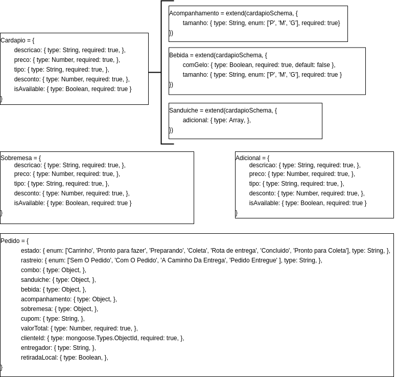
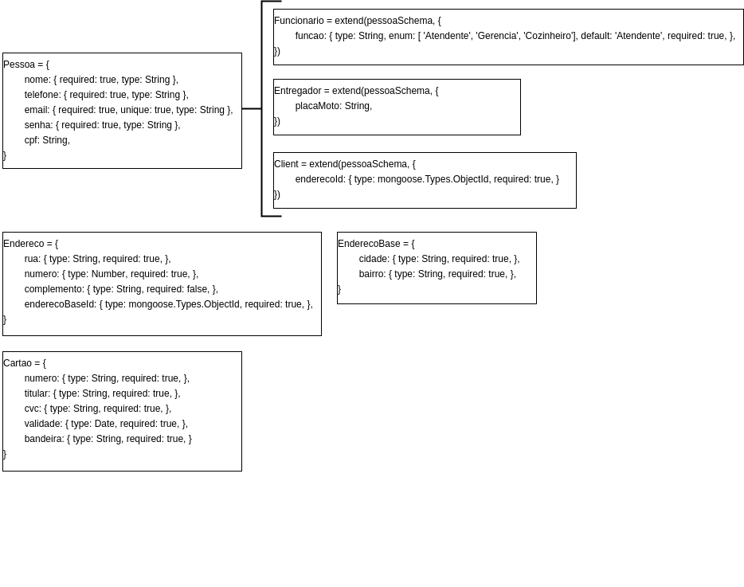

# Documento de Arquitetura de Software - DAS

## Versionamento

| Versão | Data | Modificação | Autor | Revisor |
| ------ | :--: | :---------: | :---------------------------------: | :-------------------------------------------------------------: |
| 1.0    | 09/04/2022 | Criação do Documento | Giulia Lobo Barros e Guilherme Daniel Fernandes | A definir|
| 1.1    | 11/04/2022 | Alteração de tópicos da estrutura do documento | Giulia Lobo Barros e Guilherme Daniel Fernandes | A definir |
| 1.2    | 12/04/2022 |        Adição das metas e restrições        |         Giulia Lobo Barros e Pedro Lima | A definir                |
| 1.3    | 12/04/2022 |        Adição dos casos de uso        |         Giulia Lobo Barros e Philipe Serafim          | A definir                |
| 1.4    | 13/04/2022 |        Adição da visão de processos        |         Giulia Lobo Barros e Murilo Gomes          |  A definir                |
| 1.5    | 13/04/2022 |        Adição de frames para visualização dos diagramas | Giulia Lobo Barros e Dafne Moretti | A definir                      |
| 1.6    | 15/04/2022 |    Adição da Visão de Dados   |  Liverson Paulo e Rodrigo Lima  | A definir |
| 1.7    | 15/04/2022 | Adição da Visão de Implementação | Rodrigo Lima e Lucas Andrade | A definir |
| 1.8    | 15/04/2022 | Adição da parte de Tamanho e Desempenho do Software | Giulia Lobo e João Pedro Chaves | A definir |
| 1.9    | 15/04/2022 | Adição da parte de Visão Lógica | Rodrigo Lima e Murilo Gomes | A definir |

## 1. Introdução

###  1.1. Finalidade

Esse documento tem como finalidade descrever os aspectos gerais referentes à arquitetura do projeto. Dessa forma, objetiva-se evidenciar as decisões arquiteturais tomadas, bem como os padrões adotados ao longo do densenvolvimento do projeto Chapa Quente.

### 1.2. Escopo

A finalidade desse documento é apresentar uma visão arquitetural geral do sistema desenvolvido para o projeto Chapa Quente. O documento será composto por padrões de software utilizados, componentes de software, frameworks de desenvolvimento, casos de uso e persistência de dados. Além disso, esse documento tem como objetivo descrever tecnicamente a solução adotada, tornando o projeto manutenível e apresentando os padrões a serem utilizados ao longo do seu desenvolvimento. 

###  1.3. Definições, Acrônimos e Abreviações 

| Abreviação | Acrônimo | Definição |
| :---------:| :-------:| :--------:|
| MVC | Model View Controller | Padrão de arquitetura de software, dividindo a solução em Model(M) que é a parte de regras de negócio, View(V) que é a parte responsável pela interface visualizável e Controller(C) que é responsável pelo controle dos dados. |
| PWA | Progressive Web App | Termo usado para denotar aplicativos da web que usam as últimas tecnologias da web. |
| JSON | JavaScript Object Notation | Formato compacto, de padrão aberto independente, de troca de dados simples e rápida entre sistemas. |
| NPM | Node Package Manage | Gerenciador de pacotes para o Node.js. |

### 1.4. Referências

Documento de Arquitetura. Disponível em: https://unbarqdsw2021-1.github.io/2021.1_G01_Animalesco_docs/#/pages/das-documento-de-arquitetura?id=_12-escopo; Acesso em 15/04/2022.
JSON. Disponível em: https://json.org/json-pt.html; Acesso em 15/04/2022.

### 1.5. Visão Geral

Este documento foi dividido em 7 partes com o objetivo de melhorar seu entendimento. Esse documento fica estruturado da seguinte forma:

| Tópico | Definição |
| :----: | :-------: |
| Representação Arquitetural | Tem como objetivo descrever a arquitetura da solução |
| Metas e Restrições da Arquitetura | Tem como objetivo descrever os requisitos e os objetivos do software que impactam na arquitetura |
| Visão Lógica | Tem como objetivo descrever as partes significativas do ponto de vista da arquitetura do modelo de design |
| Visão de Casos de Uso | Tem como objetivo descrever um modelo de alto nível com alta significância em relação às funcionalidades do sistema |
| Visão de Implantação | Tem como objetivo descrever a estrutura geral do modelo de implementação, a divisão do software em camadas e os subsistemas no modelo de implementação e todos os componentes significativos do ponto de vista da arquitetura |
| Visão de Processos | Tem como objetivo descrever a decomposição do sistema em processos leves e processos pesados |
| Visão de Dados | Tem como objetivo descrever a perspectiva de armazenamento de dados persistentes do sistema |
| Tamanho e Desempenho | Tem como objetivo descrever o tamanho da solução, bem como os requisitos mínimos para executá-la. |

## 2. Representação arquitetural

### **Banco de dados**
**MongoDB:** O MongoDB é um banco de dados opensource, de alta performance e flexível, sendo popular entre os bancos NoSQL. Ele tem como vantagens: maior escalabilidade e flexibilidade, bom desempenho e maior facilidade para consultas. Além disso, outra característica dele é que é orientado a documentos, ou seja, os dados são armazenados nele como documentos, diferente dos bancos relacionais que trabalham com registros de linhas e colunas. O uso do MongoDB permite uma maior tolerância a falhas, visto que esta é feita de forma automática. Outra característica importante é que o MongoDB funciona bem com Javascript, linguagem que utilizamos para o desenvolvimento da solução.

### **Backend**
**Node.js:** O Node.js é um software que permite a execução de código Javascript sem a necessidade de um navegador. Ele tem como vantagens a flexibilidade, visto que é possível realizar a instalação de outros pacotes pelo NPM e a leveza, visto que exige poucos recursos computacionais para execução. Além disso, utilizá-lo trás a vantagem de ter-se a mesma linguagem para o front e backend.

### **Frontend**

**React.js:** O React.js é uma biblioteca para Javascript que tem como foco a criação de UIs para páginas web de forma declaratica. É um framework amplamente utilizado na indústria e tem como características a facilidade para criação de UIs, extensa documentação, baixa curva de aprendizado e uma comunidade grande.

## 3. Metas Arquiteturais e Restrições da Arquitetura

### 3.1. Restrições

|  Restrições   | Descrição  |
| :-----------: | :--------: |
| Conectividade |   É necessário estabelecer conexão com internet para utilização do Chapa Quente.   |
| Idioma        |   O sistema deve ser desenvolvido para o idioma português do Brasil.   |
| Público       |   O aplicativo deve ser desenvolvido para administradores, entregadores e clientes da Lanchonete Chapa Quente.   |
| Plataforma    |   A aplicação terá suporte para browsers no computador.   |  
| Prazo Final   |   O escopo proposto deve ser terminado até o dia 18/04/2022.   |

### 3.2. Requisitos Não Funcionais

|      Metas       | Descrição  |
| :--------------: | :--------: |
|     Deploy       | A aplicação deve possuir deploy automatizado. |
| Escalabilidade   | O código deve ser estruturado e escalável o suficiente para estar aberto a futuras evoluções com o crescimento do projeto e a futuros usuários aderentes à aplicação. |
| Manutenibilidade | O código e as documentações realizadas pelo grupo devem estar em um nível de qualidade, seguindo os padrões de projeto e bibliografia, onde a sua manutenção seja fácil de ser realizada. |
| Responsividade   | A aplicação deve ser responsiva e se adaptar a todas as interfaces sem que haja comprometimento nas funções da aplicação. |
| Segurança        | O sistema deve ser seguro e lidar com os dados confidenciais dos usuários com segurança. |
| Suportabilidade  | Deve ser possível utilizar a plataforma em qualquer navegador web. |
| Usabilidade      | O sistema deve ser intuitivo e de simples uso, de forma que a curva de aprendizado para utilização dele seja fácil e clara. |

## 4. Visão Lógica

A Visão Lógica procura mostrar a organização do projeto decompondo certas em partes gerais para fácil compreensão, seguindo essa ideia, pode-se utilizar certos diagramas para fazer essa demonstração:

### 4.1. Diagrama de Pacote

Esse diagrama já foi desenvolvido pela equipe para uma entrega anterior, e pode ser facilmente acessado por meio do documento atual: [Diagrama de Pacote](pages/fase_02/diagrama_de_pacote.md).

<iframe height="600" width="700" src="https://unbarqdsw2021-2.github.io/2021.2_G1_chapa_quente/#/pages/fase_02/diagrama_de_pacote?id=diagrama-de-pacote"></iframe>

### 4.2 Diagrama de Classes
Esse diagrama já foi desenvolvido pela equipe para uma entrega anterior, e pode ser facilmente acessado por meio do documento atual: [Diagrama de Classes](pages/fase_02/diagrama_de_classes.md).

<iframe height="600" width="700" src="https://unbarqdsw2021-2.github.io/2021.2_G1_chapa_quente/#/pages/fase_02/diagrama_de_classes?id=diagrama-de-classes"></iframe>

### 4.3 Diagrama de Comunicação 
Esse diagrama já foi desenvolvido pela equipe para uma entrega anterior, e pode ser facilmente acessado por meio do documento atual: [Diagrama de Comunicação](pages/fase_02/diagrama_comunicacao.md).

<iframe height="600" width="700" src="https://unbarqdsw2021-2.github.io/2021.2_G1_chapa_quente/#/pages/fase_02/diagrama_comunicacao?id=diagrama-de-comunica%c3%a7%c3%a3o"></iframe>

### 4.4 Diagrama de Estados

Esse diagrama já foi desenvolvido pela equipe para uma entrega anterior, e pode ser facilmente acessado por meio do documento atual: [Diagrama de Estados](pages/fase_02/diagrama_de_estados.md).

<iframe height="600" width="700" src="https://unbarqdsw2021-2.github.io/2021.2_G1_chapa_quente/#/pages/fase_02/diagrama_de_estados?id=diagrama-de-estados"></iframe>

## 5. Visão de Casos de Uso

Nesta seção, apresentamos a **visão de casos de uso**, definida como aquela que descreve um modelo de alto nível com significância em relação às funcionalidades do sistema. Normalmente, essa visão é representada pelo **diagrama de casos de uso**, que auxilia no entendimento das relações entre atores do sistema, descrevendo cenários de uso da aplicação.

### 5.1. Diagrama de Casos de Uso (Já estará com as alterações necessárias feitas)

Esse diagrama já foi desenvolvido pela equipe para uma entrega anterior, juntamente com a descrição de todos os seus casos de uso e pode ser facilmente acessado por meio do documento atual: [Diagrama de Casos de Uso](pages/fase_01/casos_de_uso.md).

<iframe height="600" width="700" src="https://unbarqdsw2021-2.github.io/2021.2_G1_chapa_quente/#/pages/fase_01/casos_de_uso?id=diagrama-de-casos-de-uso"></iframe>

*Obs.:* Importante destacar que todas as alterações necessárias relacionadas a esse diagrama já foram feitas para a entrega final.

## 6. Visão de Implementação
A Visão de Implementação procura mostrar como o sistema será desenvolvido e organizado. Pode-se então utilizar o Diagrama de Componetes para tal demonstração.

### 6.1. Diagrama de Componentes

Esse diagrama já está disponível no escopo do nosso projeto, basta acessar: [Diagrama de Componentes](pages/fase_02/diagrama_de_componentes.md).

<iframe height="600" width="700" src="https://unbarqdsw2021-2.github.io/2021.2_G1_chapa_quente/#/pages/fase_02/diagrama_de_componentes?id=diagrama-de-componentes"></iframe>

## 7. Visão de Implantação

## 8. Visão de Processos

A **visão de processos** descreve como o sistema de tempo-de-execução é estruturado na forma de um conjunto de elementos que têm interações e comportamento de tempo-de-execução. A estrutura de tempo-de-execução normalmente tem pouca semelhança com a estrutura de código. Além disso, permite a visualização das partes dinâmicas do sistema, onde são evidenciados os processos, as threads e as interações entre elas.

Nessa visão, nós podemos ter 2 representações que auxiliam em seu entendimento:

### 8.1. Diagrama de Atividades (Já estará com as alterações necessárias feitas)

Esse diagrama já está disponível no escopo do nosso projeto, basta acessar: [Diagrama de Atividades](pages/fase_02/diagrama_de_atividade.md).

<iframe height="600" width="700" src="https://unbarqdsw2021-2.github.io/2021.2_G1_chapa_quente/#/pages/fase_02/diagrama_de_atividade?id=diagrama-de-atividade"></iframe>

*Obs.:* Importante destacar que todas as alterações necessárias relacionadas a esse diagrama já foram feitas para a entrega final.

### 8.2. Diagrama de Sequência (Já estará com as alterações necessárias feitas)

Esse diagrama já está disponível no escopo do nosso projeto, basta acessar: [Diagrama de Sequência](pages/fase_02/diagrama_de_sequencia.md).

<iframe height="600" width="700" src="https://unbarqdsw2021-2.github.io/2021.2_G1_chapa_quente/#/pages/fase_02/diagrama_de_sequencia?id=diagrama-de-sequ%c3%aancia"></iframe>

*Obs.:* Importante destacar que todas as alterações necessárias relacionadas a esse diagrama já foram feitas para a entrega final.

## 9. Visão de Dados
A **visão de Dados** é um tópico que se dispõe a mostrar quais são os dados persistentes na aplicação, geralmente utiliza-se ferramentas como um Modelo Entidade-Relacionamento e/ou Diagrama Entidade-Relacionamento para isso, entretanto no projeto Chapa Quente foi utilizado um sistema não-relacional, tornando essas ferramentas inoportunas nesse contexto. Como foi utilizado o MongoDB, que é um banco de dados orientado a documentos JSON, foi preferivel utilizar um sistema que mostra os objetos da camada "Model", pois esses são os objetos que são mapeados para a camada persistente, ou seja, para o banco de dados.

Para melhor visualização, as tabelas que mostram os objetos supracitados foram dividos em duas imagens:

> Figura 1: Visão de dados - pedido. Autor: Rodrigo Lima. 

> Figura 2: Visão de dados - pessoa. Autor: Rodrigo Lima. 

## 10. Tamanho e Desempenho

### 10.1. Requisitos Mínimos

* É necessário possuir conexão com a internet;
* Navegador com suporte a HTML 5, CSS e JavaScript;
* Para desenvolvimento de possuir: Windows, Linux ou MacOS.

### 10.2. Visão Geral

O tamanho da aplicação, tendo como base todos os repositórios, juntos dão menos que 1GB, sendo que não é necessária a instalação de nenhum outro programa para seu funcionamento. Já quanto ao desempenho, para o uso do sistema, é necessário conexão com a internet por ser uma PWA, além disso, a opção de dispositivo é flexível, podendo ser utilizado tanto em todos os tipos de computadores. O desempenho também considera a grande gama de pessoas que utiliza o aplicativo diariamente, contando com cliente, cozinheiros, funcionários em geral e entregadores.

## Conclusão

## Bibliografia

- 